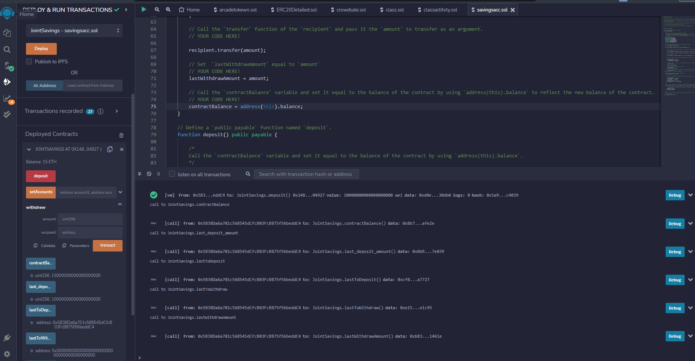
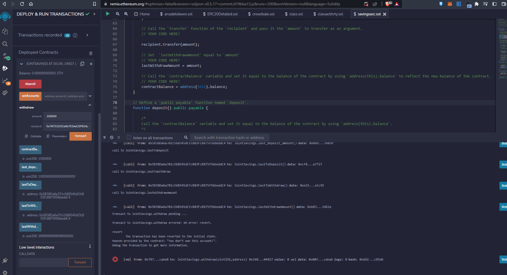

# Joint-Savings-account-smart-contract
Challenge 20 for Fintech bootcamp through UC Berkeley. Using Solidity to create a smart contract that functions like a Joint-Savings account using Ether (ETH). This contract has the functionality to accept two valid ethereum addresses to set as eligible to withdraw. It can take ether from any wallet and store it in the contract, but only the two preset addresses can withdraw ETH. The contract has some public variables such as `lastToWithdraw`,`lastToDeposit` and the values for each last transaction, as well as the contract balance in wei. The below screenshots show some simple interactions including depositing and withdrawing eth.

In the above photo i have gone ahead and deposited some ETH to the contract and set two addresses.

In the photos above I withdrew 11 ETH and then tried to do the same transaction which failed due to not enough funds.

In this last photo we see an account error when i try to use an un-verified account to withdraw funds, which the contract does not allow.

If you want to run this contract yourself in remix or a similar IDE follow along below.

---
## Get setup

To run this contract yourself simply copy the `joint_saving.sol` file or clone the repo and copy the file there. Navigate to remix's website or a similar IDE and paste the contract code into a .sol file. Compile and deploy the contract and start messin

---

## Contributors

[Robin Thorsen](https://www.linkedin.com/in/robin-thorsen-079819120/) was the developer who worked on this project. 

---

## License

Apache 2.0 public License applied, feel free to clone and fork and use and reach out if you have questions. 

